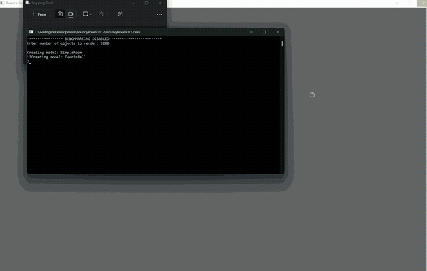
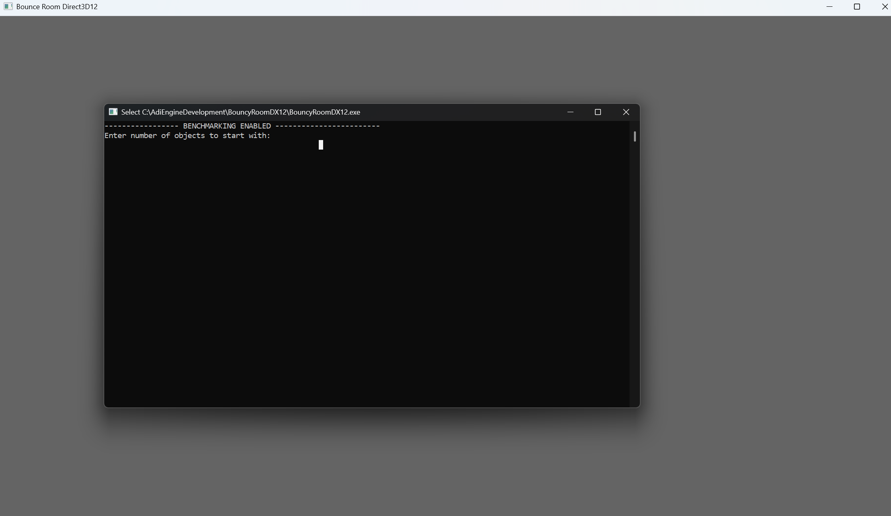
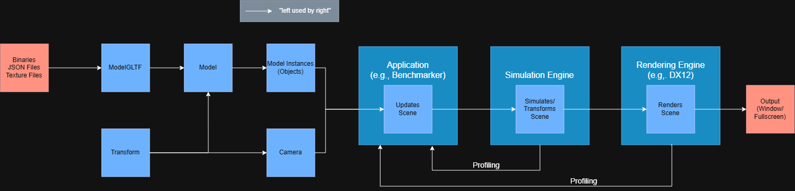

# BouncyRoomDX12
A low-level graphics + physics engine project with the goal of increasing the max number of bouncy objects in a room, while maintaining 60fps at stable state. See [Hardware](#Hardware) and [Scene](#Scene) sections below for current setup.

Note: All code is architected and written by hand, AI is referenced only for learning/clearing up concepts

### Video/Screenshots
Note that balls are currently stationary as a baseline  
  
Video link: [Video](docs/videos/BouncyRoomRecording.mp4)

### Usage: 
Ideally you should build the .sln. But you can try running the binary (BouncyRoomDX12.exe) directly, although that may not work.  
Once loaded you should see the terminal and a separate render window. The terminal will ask you how many balls to render.  

# Recent Performance

### Latest Relevant Commit
- **Max Balls Rendered at 60 FPS**: 712
- **Bottleneck**: CPU bound
- Commit ID: fc75cbc047654c758f63cb5fff36398c15dd4eed
- Commit Name: [STRATEGY][CLEANUP] Streamlined pipeline and root signature creation

### Previous Relevant Commit
- **Max Balls Rendered at 60 FPS**: 215
- **Bottleneck**: CPU bound
- **Memory**: Severe memory use ( > 8 GB) due to repeated creation of PSO
- Commit ID: b9814309d5b4ef4c311200908a49a68d24ef8b52
- Commit Name: [SCENE][CLEANUP][BENCHMARK] Set up a basic room with stationary balls

# Current Metrics when Rendering Max Balls at 60fps
- Number of objects: 712
- Total frames measured: 300
- Median Draw Calls: 1439
- Median CPU Time: 16ms
- P95 CPU Time: 24ms
- P99 CPU Time: 26ms
- Median GPU Time: 13.9172ms
- P95 GPU Time: 19.8149ms
- P99 GPU Time: 22.4696ms
- Memory: 612 MB RAM

# Scene
- **Resolution**: 1920 x 1080
- **Camera**: Perspective, fixed path revolution
- **Lights**: NONE
- **Shadows**: NONE
- **Physics**: NONE
- **VSync**: OFF
- **Present mode**: Windowed
- **Build configuration**: RELEASE + DX12 Debug mode off

## Models
| Model       | Vertices | Triangles | Textures (Resolution) | Source                                                                                                                                              |
| ----------- | -------- | --------- | --------------------- | --------------------------------------------------------------------------------------------------------------------------------------------------- |
| Simple Room | 9200     | 17900     | 6 (2048 x 2048/1024)  | "simple room" (https://skfb.ly/oU8HH) by kira.is.real is licensed under Creative Commons Attribution (http://creativecommons.org/licenses/by/4.0/). |
| Tennis Ball | 764      | 1500      | 6 (2048 x 2048)       | "Tennis Ball" (https://skfb.ly/6yZCW) by Tentrox is licensed under Creative Commons Attribution (http://creativecommons.org/licenses/by/4.0/).   |

# Current Test Sequence

Benchmarking recording:
  

1. **Warm up**
   - Run `N` (e.g., 100) frames with `x` number of starting objects.

2. **Exponential Search**
   - Double the number of objects after each passing benchmark until it fails the first time
   - Continue until the first failing object count is found.
   - Record:
	   - `LowerBound` = highest passing object count
	   - `UpperBound` = lowest failing object count

3.  **Measurement**
   - After changing object count, wait for `N` (e.g., 100) frames to stabilize
   - Measure `M` (e.g., 100) number of frames after stabilization 

4. **Analysis**
   A benchmark passes when:
   - Median CPU frame time < 16 ms AND
   - Median GPU frame time < 16 ms

5. **Adjustment**
   - If conditions not met:
	   - Test the midpoint between `LowerBound` and `UpperBound`.
	   - If it passes, set `LowerBound = midpoint`
	   - If it fails, set `UpperBound = midpoint`
	   - Repeat until `(UpperBound - LowerBound) / LowerBound <= P%`
   - If all conditions met, exit and save [[#Current Metrics when Rendering Max Objects at 60fps]]

# Current Code Flow Architecture

# Hardware
## CPU
- **OS**: Windows 11 Home
- **Model**: 12th Gen Intel(R) Core(TM) i7-1255U 
- **Physical** Cores: 10
- **Logical** **Processors**: 12
- **Base Clock**: 2.6 kHz (same as max)
- **RAM**: 16 GB LPDDR5-5200
- **L2 Cache Size**: 6656 kB (6 MB)
- **L3 Cache Size**: 12288 kB (12 MB)

## GPU
- Model: Intel(R) Iris(R) Xe Graphics
- Driver Version: 32.0.101.7084
- Dedicated VRAM: 128 MB
- Shared System Memory: 8104 MB
- Max D3D Feature Level: 12_1
- Max Shader Model: 6.7
- UMA: Yes
- Cache-Coherent UMA: Yes
- Num SIMD Lanes: 1536
- Resource Binding Tier: 3
- Resource Heap Tier: 2
- Mesh Shader Tier: Not Supported
- Raytracing Tier: Not Supported
- Variable Rate Shading Tier: 1

# To-Dos
## Scene
Add velocities to balls  
Add collision detection with room walls  
Add collision detection between balls  
Add ball rotation and angular momentum/velocity calculations  
Add lighting to scene  
Add physically based rendering  
Sample multiple textures (normal, albedo, tangent etc) instead of just the default one  
Full screen application  
Multiple ball models (varying shapes, number of vertices etc)  
(many more pending further analysis)  

## Optimization Strategies
### **CPU-bound**
ECS  
Multithreaded calculations/command lists  
Pipelining Application->Simulation->Rendering using queues  
Move computation to GPU (Compute Shaders > SYCL/CUDA)  
(more pending further analysis)  

### **GPU-bound**
Instancing/batching  
Culling (occlusion, back-face, frustum)  
Reducing overdraw  
Light-baking  
(more pending further analysis)  

## Cleanup/Fixes
Make all objects that use D3D12 specifics outside the rendering engine either not use them or use interfaces  
Add more metrics:  
- AvgVisibleObjectsPerFrame
- AvgDrawCallsPerFrame
- AvgTrianglesRenderedPerFrame
- PrimaryBottleneck: CPU | GPU | Mixed
Currently, ModelInstances only differ with each other with transforms, not other stuff (textures etc)  

## Capabilities
Move all D3D12 specifics into a custom ModelD3D12 object, making the regular Model free on DX12 specifics so that we can swap renderers in the future

## Benchmarking
Add CPU and GPU memory metrics
Add more granular timing metrics (Application vs SimulationEngine vs RenderingEngine etc)
# Commit Syntax
- [STRATEGY] {optimization strategy}: {max num of objects at 60fps}
	- e.g., [STRATEGY] Added Instancing: 300
- [SCENE] {updates to scene, such as lighting/shadows/physics/objects etc}: {max num of objects at 60fps}
	- e.g., [SCENE] Added Fixed Directional Lighting: 250
- [CAPABILITY] {new support/QoL related features added like Vulkan/XR etc.}: {max num of objects at 60fps}
- [HARDWARE] {updates to current hardware, like VR Headset/Graphics Card/RAM}: {max num of objects at 60fps on updated hardware}
	- e.g., [HARDWARE] Now using Nvidia RTX-5080: 3000
- [FIX] {bug fixes}
- [BENCHMARKER] {new added metrics or changes to benchmarking/reporting}
	- e.g., [BENCHMARKER] Added Measuring 1% GPU Frame time: 250
- [DOCUMENTATION] {readme updates, comments etc}
- [CLEANUP] {refactors to improve modularity/scalability, removing unused code/comments}

# History (latest to oldest)
(See commit history)
